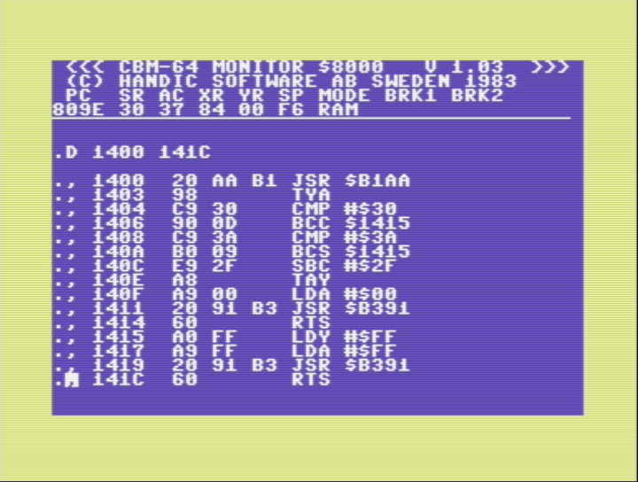

# Commodore 64 Assembler programming

## Screenshots

  
*Dump of [assembly code](day01-assembler.asm) with 64MON cartridge*  

## Problem: the VAL function

For the solution of the proposed advent of code program you cannot use directly the VAL function because the value `0` is returned both from the "0" character and for any other character not in range "0"-"9". For example:
```
    **** COMMODORE 64 BASIC V2 ****

 64K RAM SYSTEM  38911 BASIC BYTES FREE

READY.
PRINT VAL("Q")
 0

READY.
PRINT VAL("0")
 0

READY.
PRINT VAL("7")
 7

READY.

```

## The USR function

Commodore 64 basic can leverage an user defined assembler function that accept a parameter (see [USR](https://www.c64-wiki.com/wiki/USR)).

To create the function you have to write some assembler (or machine language code) into memory and indicate the memory address to call the function at addresses `785–786` (dec) or `$0311–$0312` (hex).

## Solution: A custom VAL function

By defining a custom `USR` function is possible to have a custom `VAL` function that return `-1` for all characters not in range "0"-"9" or the correct value. The [assembler code](day01-assembler.asm) was created using the `64MON` cartridge mentioned in *C64 Programmer reference*.  
Because the value passed is loaded into [FAC](https://www.c64-wiki.com/wiki/FAC) (Floating Point Accumulator) the number is first converted using FACINX [routine](https://www.c64-wiki.com/wiki/Floating_point_arithmetic#Routines_for_converting_between_floating_point_and_other_formats) to store it as an integer, then compared with range boundaries for chars "0" and "9" to give you the result.

## Cartridge

Find and download `64MON by HANDIC SOFTWARE 1983` (filename: `handics_64mon.crt`)

### Commands

#### In Basic mode
- `SYS 32820` to enter assembler mode

#### In assembler mode
- `.X` to exit assembler mode and return to Basic
- `F7` to display help/command list screen
- `.A $$$$ <instruction>` to create an assembly instruction at given address (e.g. `.A 1400 BRK`)
- `G $$$$` go to given address and start execution

## Books and documentation

- Chapter 5, "BASIC TO MACHINE LANGUAGE" in C64 Programmer reference" by Commodore Computers (this is the [cover](c64_programmer_reference_book_cover.jpg))
- [Floating point arithmetic](https://www.c64-wiki.com/wiki/Floating_point_arithmetic)
- [I segreti del linguaggio macchina](https://archive.org/details/commodore64isegretidellinguaggiomacchina/mode/1up)
- [data conversion functions](https://sta.c64.org/cbm64basconv.html)
