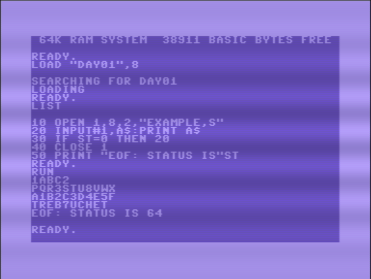
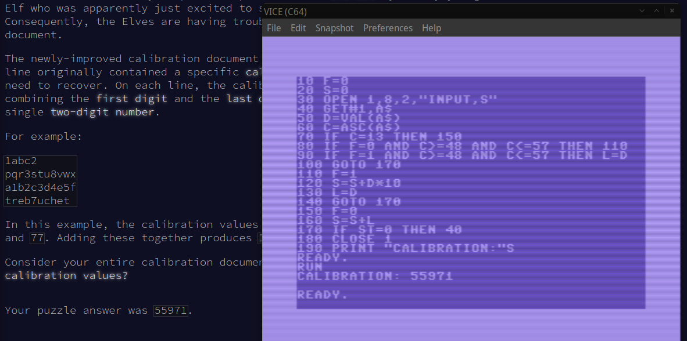

# ADVENT OF CODE ~~2023~~ 1983

## Screenshots

  
*Loading the example input and print it to screen*  
  
*Solving Advent of code day01 part 1 on Commodore 64 with `VICE`*  

## Requirements for Linux

- Install `VICE` e.g. on Ubuntu `apt-get -y install vice`
- Get ROMS for Commodore 64 and place under your home directory ~/.local/share/vice
```
 ~]$ tree .local/share/vice/
.local/share/vice/
├── C64
│   ├── basic
│   ├── chargen
│   └── kernal
└── DRIVES
    └── d1541II
```

## Quickstart

Download `day01.d64` and run it with `VICE` emulator.

## Development

### Trasforming input

Use `ascii2petscii.sh` to create a [PETSCII](https://en.wikipedia.org/wiki/PETSCII) file from a text file. For example `./ascii2petscii.sh example`

### Creating a disk

#### Manually with VICE

- Open `VICE` emulator
- From `VICE` menu select "Create and attach an empty disk image". Choose a filename, e.g. `day01.d64`.
- From your computer copy in your clipboard the content of day01.bas
- From `VICE` menu select "Edit - Paste"
- In the C64 screen type `SAVE "DAY01",8`
- To check that you saved correctly, list the disk content `LOAD "$",8` and then `LIST`
- Close (exit) `VICE` emulator
- Use `c1541` (part of vice) to write input files to disk as Commodore `SEQ` files: `c1541 -attach day01.d64 -write example.petscii "example,s" -write input.petscii "input,s"`
- Check that you loaded file correctly: `c1541 -attach day01.d64 -list`
- Start your program in `VICE`: `x64 -autostart day01.d64`

#### Manually with compiler

You can use [MOSpeed](https://github.com/EgonOlsen71/basicv2) to compile a `.bas` file into a `.prg` file ([documentation](https://www.c64-wiki.com/wiki/MOSpeed))

```
./mospeed.sh day01.bas -target=day01.prg -platform=c64
c1541 -format aoc2023,01 d64 day01.d64 -attach day01.d64 -write day01.prg "day01" -write example.petscii "example,s" -write input.petscii "input,s"
x64 -autostart pluto.d64
```

#### Automatically with a script on Linux

`./compile.sh day01.bas`
